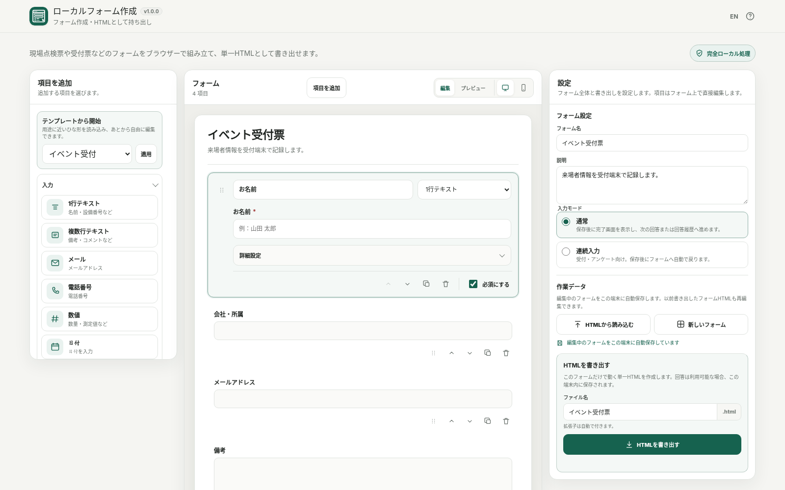

# Local Form Builder / ローカルフォーム作成

[](https://github.com/ttomohisa/htmlapps-local-form-builder/actions/workflows/deploy-pages.yml)
[](LICENSE)
[](https://ttomohisa.github.io/htmlapps-local-form-builder/)

[English README](README.md)

Local Form Builder は、フォームをブラウザー内で作成し、そのフォーム自体を **持ち運べる単一HTML** として書き出す Browser Kitty のツールです。生成したフォームの回答もクラウドへ送らず、利用端末のブラウザー内で管理できます。

## 🚀 デモ

### [GitHub PagesでLocal Form Builderを開く](https://ttomohisa.github.io/htmlapps-local-form-builder/)

GitHub Pages版は最初のHTMLだけを配信します。フォーム設計、プレビュー、入力チェック、フォームHTML生成、回答保存、CSV / JSON出力、印刷はブラウザー内で処理します。フォーム内容や回答をアプリからサーバーへアップロードしません。

[](https://ttomohisa.github.io/htmlapps-local-form-builder/)

## Features

- **現場で使うフォームを視覚的に作成** — 点検票、受付票、アンケート、チェックリスト、ヒアリングシートなどに使える14種類の基本項目を用意しています。
- **項目をその場で編集** — フォーム上の項目を選ぶと、質問文、種類、選択肢、必須、初期値、入力チェックをカード内で編集できます。
- **好きな位置へ項目を追加** — クリックで末尾へ追加するほか、PCでは新しい項目をフォーム内の任意位置へドラッグできます。既存項目も専用ハンドルで並べ替えられます。
- **6種類のテンプレート** — 空、イベント受付、現場点検、アンケート、チェックリスト、ヒアリングから開始できます。
- **フォームそのものを単一HTML化** — UI、入力チェック、回答履歴、CSV / JSON、印刷まで含んだ1ファイルのフォームを生成します。
- **回答を端末内に保存** — 生成フォームはIndexedDB / localStorageを実際に読み書きテストしてから使用し、永続保存できない場合は警告します。
- **回答を明示的に持ち出し** — CSV、完全JSONバックアップ、追加 / 置き換え復元、空フォーム / 回答済みフォームの印刷に対応します。
- **後から編集を再開** — Builderの下書きを端末内へ自動保存できます。以前に書き出したLocal Form BuilderのHTMLも、HTML自体を実行せずschemaだけを読み込んで再編集できます。読み込む項目の識別子もデータとして扱います。
- **完全ローカル処理** — アカウント、analytics、telemetry、CDN、外部フォント、実行時外部通信はありません。CSPは `connect-src 'none'` です。
- **日本語 / 英語・PC / スマホ** — PCでは3ペイン、スマホでは「フォーム / 項目 / 設定」の下部タブで操作できます。

## Quick start

### Webデモを使う

[デモを開く](https://ttomohisa.github.io/htmlapps-local-form-builder/)だけで使えます。インストールやアカウント登録は不要です。

### 単一HTMLのBuilderを使う

1. このリポジトリの `dist/index.html` を取得するか、ローカルでビルドします。
2. 現行ブラウザーで開きます。
3. フォームを作成し、**HTMLを書き出す** を実行します。
4. 生成されたフォームHTMLを、実際に使用するPC・スマートフォン・タブレットへコピーします。

### 完全オフラインで使う（上級）

1. このリポジトリをダウンロードまたはcloneします。
2. Windowsで `build-standalone.bat` をダブルクリックします。
3. 生成された `dist/index.html` を必要な場所へコピーします。
4. 以降はネットワーク接続なしでその単一HTMLを開けます。

標準のWindowsビルドにPython、Node.js、ローカルWebサーバーは不要です。Windows PowerShellとBrowser Kittyの単一HTMLテンプレート構成を使用します。

## 使い方

1. 空のフォーム、または6種類のテンプレートから開始します。
2. **項目を追加** または左の項目パレットから項目を追加します。PCでは項目種類をそのままフォーム内の好きな位置へドラッグできます。
3. フォーム上の項目を選択し、カード内で質問文・種類・選択肢・必須を編集します。
4. **詳細設定** で補足、プレースホルダー、初期値、入力チェックを設定します。
5. **プレビュー** に切り替えると実際の入力欄を操作できます。**入力を確認** では生成フォームと同じ入力チェックを実行します。
6. **設定** で通常入力 / 連続入力、出力ファイル名を設定し、単一HTMLを書き出します。
7. 生成した `.html` を現場端末で開き、回答を保存します。
8. **回答履歴** から検索、編集、複製、削除、印刷、CSV、JSONバックアップ / 復元を実行できます。
9. 生成済みフォームを後から変更する場合は、Builderの **HTMLから読み込む** を使います。HTMLは実行せず、埋め込まれた `local-form-schema` JSONだけを読み込みます。

### 項目種類

| 分類 | 項目 |
| --- | --- |
| 入力 | 1行テキスト、複数行テキスト、メール、電話番号、数値、日付、時刻 |
| 選択 | ラジオ、セレクト、チェックボックス、複数チェック |
| 表示 | 見出し、説明文、区切り |

### 入力チェック

| 項目 | 対応内容 |
| --- | --- |
| 全入力項目 | 必須 |
| テキスト / 複数行 / メール / 電話 | 最小 / 最大文字数 |
| メール | メール形式 |
| 数値 | 最小値 / 最大値 / 刻み幅 |
| 日付 | 開始日 / 終了日 |
| 複数チェック | 最小 / 最大選択数 |

### 入力モード

- **通常** — 保存後に回答日時、回答件数、「次の回答」「回答履歴」を表示します。
- **連続入力** — 短い完了表示のあと入力欄を自動リセットし、次の回答へ戻ります。受付や会場アンケート向けです。

連続入力は操作フローを変える機能であり、回答履歴を保護するセキュリティ機能ではありません。

## CSVとJSONバックアップ

生成フォームでは役割の異なる2種類の出力を用意しています。

- **CSV** は閲覧・集計用です。UTF-8 BOM、CRLF、CSVエスケープ、同名項目の列名一意化、表計算ソフトのFormula Injection対策を行います。
- **JSONバックアップ** は完全バックアップ / 復元用です。フォーム情報、schema、全回答を含みます。

JSON復元には **追加** と **置き換え** があります。追加では既存の `responseId` をスキップします。置き換えではバックアップを検証してから現在の回答履歴を入れ替えます。別フォームや非対応形式は、ローカルデータを変更する前に拒否します。

## GitHub Pagesで公開する

リポジトリにはBrowser Kittyテンプレートのビルド / Pages配信用workflowが含まれています。

1. `htmlapps-local-form-builder` としてGitHubへpushします。
2. **Settings → Pages → Build and deployment → Source** で **GitHub Actions** を選択します。
3. `main` へpushするか、ActionsからPages workflowを実行します。
4. 成功後、`https://ttomohisa.github.io/htmlapps-local-form-builder/` で利用できます。

Pages版でも、フォーム設計や回答処理そのものはブラウザー内で行います。

## 開発・ビルド構成

```text
.
├─ src/index.template.html       # 編集対象のアプリ本体
├─ app.config.json               # アプリ情報・ビルド設定
├─ dependencies.json             # 実行時依存定義（現在は空）
├─ dependencies.lock.json        # 依存ロック
├─ assets/
│  ├─ favicon.svg
│  ├─ screenshot.png
│  └─ screenshot-en.png
├─ build-standalone.bat          # Windowsビルド入口
├─ build-standalone.ps1          # 単一HTMLビルダー
├─ scripts/                      # リポジトリ / standalone検証
└─ dist/
   ├─ index.html                 # readable単一HTML
   └─ index.self-extract.html    # 圧縮自己展開版
```

実装変更前には次の順で確認します。

1. `AGENTS.md`
2. `APP_SPEC.md`
3. `docs/ARCHITECTURE.md`
4. `docs/LLM_WORKFLOW.md`

`dist/` は生成物です。直接編集しません。

## ビルド

Windows 10 / 11 で次を実行します。

```bat
build-standalone.bat
```

テンプレート標準ビルドでリポジトリ契約を確認し、readable版とself-extract版を生成・検証します。

主な成果物:

```text
dist/
├─ index.html
├─ index.self-extract.html
├─ dependency-manifest.json
├─ build-size-report.json
├─ self-extract-manifest.json
└─ .nojekyll
```

## プライバシーと外部通信

Builderと生成フォームは完全ローカル処理を前提にしています。

- CSPは `connect-src 'none'` です。
- 実行時の第三者ライブラリ、CDN、外部フォント、analytics、telemetryはありません。
- フォームschema、プレビュー入力、回答、CSV、JSONバックアップ、読み込んだHTMLはブラウザー内で処理します。
- Builderの下書き自動保存と、生成フォームの回答履歴保存は別のローカル保存領域です。
- 生成フォームは実際に書込 → 読出 → 削除テストを行い、成功した保存方式だけを使用します。
- 永続保存できない場合はメモリへフォールバックし、画面上で警告します。

GitHub Pages版では最初のHTML取得だけネットワークを使用します。ネットワークを完全に切った状態で使う場合は、生成した `dist/index.html` をローカルで開いてください。

## 制限事項

- クラウドフォームサービスではありません。アカウント、サーバー側の回答集約、共有ダッシュボード、メール通知、Webhook、自動クラウド同期はありません。
- v1.0.0では条件分岐、計算項目に対応していません。
- v1.0.0では写真、署名、QR / バーコード、GPS、ファイル添付に対応していません。
- ブラウザー保存領域は、ブラウザー設定、プライベートブラウズ、端末のクリーンアップなどで消える可能性があります。重要な回答履歴はJSONバックアップを保存してください。
- `file://` の保存挙動はブラウザーによって異なる場合があります。生成フォームは永続保存できると仮定せず、起動時のCapability Testを結果の基準にします。
- パスワード、認証秘密情報、カード情報など、高機密の認証・決済情報を保存する用途は想定していません。
- 大量の回答履歴はブラウザーの保存容量や端末メモリの制約を受けます。

## Dependencies

Local Form Builder v1.0.0には **第三者の実行時依存ライブラリはありません**。ブラウザーAPIとBrowser Kittyの単一HTMLテンプレート基盤で動作します。

リポジトリ内の通知については [THIRD_PARTY_NOTICES.md](THIRD_PARTY_NOTICES.md) を参照してください。

## Contributing

バグ報告や機能提案はGitHub Issuesから歓迎します。開発手順は [CONTRIBUTING.md](CONTRIBUTING.md) を参照してください。

## License

Copyright © 2026 ttomohisa

[MIT License](LICENSE) で公開しています。
