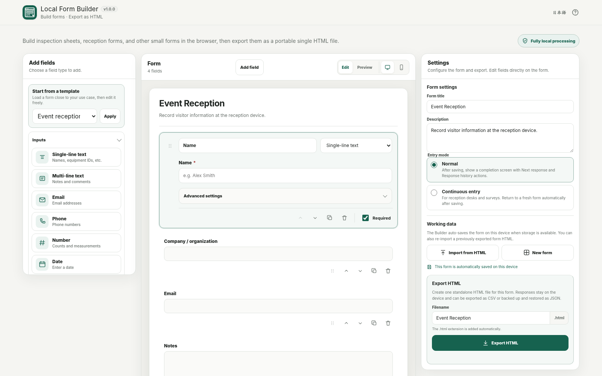

# Local Form Builder

[](https://github.com/ttomohisa/htmlapps-local-form-builder/actions/workflows/deploy-pages.yml)
[](LICENSE)
[](https://ttomohisa.github.io/htmlapps-local-form-builder/)

[日本語版 README](README.ja.md)

A privacy-focused form builder that runs in the browser, exports each form as a portable single HTML file, and keeps responses on the device instead of sending them to a cloud form service.

## 🚀 Live demo

### [Open Local Form Builder on GitHub Pages](https://ttomohisa.github.io/htmlapps-local-form-builder/)

GitHub Pages delivers the initial Builder HTML. Form design, preview, validation, generated-form export, response storage, CSV/JSON export, and printing are processed locally in the browser. The app does not upload your form content or responses to a server.

[](https://ttomohisa.github.io/htmlapps-local-form-builder/)

## Features

- **Build practical forms visually** — Add fourteen core field types for inspections, reception sheets, surveys, checklists, and interviews.
- **Edit where you are looking** — Select a field and edit its question, type, choices, required state, defaults, and validation directly on the form card.
- **Place fields naturally** — Click to append, drag a new field into a specific position, or reorder existing fields with an explicit drag handle.
- **Start faster with templates** — Use built-in Blank, Event reception, Site inspection, Survey, Checklist, and Interview sheet starters.
- **Export a real standalone form** — Save the form as one `.html` file containing its UI, validation, local response workflow, history, CSV/JSON tools, and print styles.
- **Keep responses on the device** — Generated forms probe IndexedDB and localStorage before using them and clearly warn when only memory storage is available.
- **Take data out explicitly** — Export spreadsheet-friendly CSV, create a complete JSON backup, restore in Add or Replace mode, or print a blank / completed form.
- **Continue editing later** — The Builder can auto-save its draft locally and safely re-import a previously exported Local Form Builder HTML without executing the imported document.
- **Private by design** — No account, analytics, telemetry, CDN assets, remote fonts, or runtime external requests. The standalone runtime uses `connect-src 'none'`.
- **Japanese / English, desktop / mobile** — The Builder has bilingual UI, a three-panel desktop workspace, and Form / Fields / Settings bottom tabs on phones.

## Quick start

### Use the web demo

Just [open the demo](https://ttomohisa.github.io/htmlapps-local-form-builder/). No installation or account is required.

### Use the standalone Builder

1. Download `dist/index.html` from this repository or build it locally.
2. Open the file in a current browser.
3. Design a form and choose **Export HTML**.
4. Copy the generated form HTML to the PC, phone, or tablet where it will be used.

### Use it fully offline (advanced)

1. Download or clone this repository.
2. Double-click `build-standalone.bat` on Windows.
3. Copy `dist/index.html` wherever you need it.
4. Open that single file later without an internet connection.

Python, Node.js, and a local web server are not required for the standard Windows build. The builder uses Windows PowerShell and the Browser Kitty single-HTML template pipeline.

## Usage

1. Start from a blank form or choose one of the six built-in templates.
2. Add fields from **Add field** or the left field palette. On desktop, you can drag a field type directly to the position you want.
3. Select a field on the canvas to edit it in place. Choice fields expose their options directly below the question.
4. Open **Advanced settings** for helper text, placeholders, initial values, and applicable validation rules.
5. Switch to **Preview** to try the form with real controls. Use **Check input** to run the same validation model used by exported forms.
6. In **Settings**, choose Normal or Continuous entry mode, edit the output filename, and export the standalone HTML.
7. Open the generated `.html` file and save responses locally on that device.
8. Use **Response history** to search, edit, duplicate, delete, print, export CSV, or save/restore a JSON backup.
9. To revise an exported form later, use **Import from HTML** in the Builder. The imported HTML is not executed; only the embedded `local-form-schema` JSON is read.

### Field types

| Group | Fields |
| --- | --- |
| Input | Text, Textarea, Email, Phone, Number, Date, Time |
| Choice | Radio, Select, Checkbox, Checkbox group |
| Layout | Heading, Explanatory text, Divider |

### Validation

| Field | Validation |
| --- | --- |
| All input fields | Required |
| Text / Textarea / Email / Phone | Minimum / maximum length |
| Email | Email format |
| Number | Minimum / maximum / step |
| Date | Earliest / latest date |
| Checkbox group | Minimum / maximum selections |

### Entry modes

- **Normal** — After saving, show the saved timestamp, response count, Next response, and Response history actions.
- **Continuous** — Show a short completion message, reset the form, and return to the next entry automatically. This is useful for reception desks and kiosk-style surveys.

Continuous mode changes the workflow only; it is not an access-control or security feature.

## Response export and backup

Generated forms provide two intentionally different outputs:

- **CSV** is for viewing and analysis. It uses UTF-8 BOM, CRLF line endings, correct CSV escaping, unique headers for duplicate labels, and spreadsheet-formula injection protection.
- **JSON backup** is for complete backup and restore. It includes form metadata, the form schema, and all saved responses.

JSON restore supports **Add** and **Replace** modes. Add skips response IDs already present. Replace validates the backup before replacing the current history. Backups for another form or an unsupported format are rejected before local data is changed.

## Publish with GitHub Pages

The repository includes the Browser Kitty template workflow for building and deploying the standalone app.

1. Push the repository to GitHub as `htmlapps-local-form-builder`.
2. Open **Settings → Pages → Build and deployment → Source** and select **GitHub Actions**.
3. Push to `main`, or manually run the Pages workflow from the Actions tab.
4. After a successful deployment, the demo is available at `https://ttomohisa.github.io/htmlapps-local-form-builder/`.

The deployed page still performs the actual form design and response processing locally in the browser.

## Development and build layout

```text
.
├─ src/index.template.html       # Editable application source
├─ app.config.json               # App metadata and build settings
├─ dependencies.json             # Runtime dependency declaration (currently empty)
├─ dependencies.lock.json        # Dependency lock file
├─ assets/
│  ├─ favicon.svg
│  ├─ screenshot.png
│  └─ screenshot-en.png
├─ build-standalone.bat          # Windows build entry point
├─ build-standalone.ps1          # Standalone HTML builder
├─ scripts/                      # Repository / standalone verification
└─ dist/
   ├─ index.html                 # Readable standalone Builder
   └─ index.self-extract.html    # Compressed self-extracting Builder
```

Before changing implementation, read:

1. `AGENTS.md`
2. `APP_SPEC.md`
3. `docs/ARCHITECTURE.md`
4. `docs/LLM_WORKFLOW.md`

Do not edit generated files in `dist/` manually.

## Build

On Windows 10/11:

```bat
build-standalone.bat
```

The standard template build checks the repository contract, generates the readable standalone HTML, creates the self-extracting variant, and verifies the outputs.

Expected artifacts:

```text
dist/
├─ index.html
├─ index.self-extract.html
├─ dependency-manifest.json
├─ build-size-report.json
├─ self-extract-manifest.json
└─ .nojekyll
```

## Privacy and runtime network protection

The Builder and generated forms are designed for fully local processing:

- The Content Security Policy contains `connect-src 'none'`.
- There are no third-party runtime libraries, CDN assets, external fonts, analytics, or telemetry.
- Form schemas, Preview input, responses, CSV data, JSON backups, and imported HTML are processed in the browser.
- Builder draft auto-save and generated-form response storage are separate local-storage workflows.
- Generated forms test storage with a real write/read/delete round trip before claiming persistent storage is available.
- If persistent storage is unavailable, the generated form falls back to memory and shows a visible warning.

The GitHub Pages version requires the initial page request. For use with the network disconnected, open the generated `dist/index.html` locally.

## Limitations

- Local Form Builder is not a cloud form service. It does not provide accounts, server-side response collection, shared dashboards, email notifications, webhooks, or automatic cloud synchronization.
- Conditional logic and calculated fields are not included in v1.0.0.
- Photo, signature, QR/barcode, GPS, and file-upload fields are not included in v1.0.0.
- Browser-managed storage can be cleared by browser settings, private-browsing behavior, or device cleanup. Use JSON backup for important response history.
- `file://` storage behavior can differ by browser. The generated form performs a capability test instead of assuming persistence.
- The app is not intended to store passwords, authentication secrets, payment-card data, or similar high-sensitivity credentials.
- Large response histories are still subject to browser storage and device-memory limits.

## Dependencies

Local Form Builder v1.0.0 has **no third-party runtime dependency**. The application and generated forms use browser APIs and the Browser Kitty single-HTML template infrastructure.

See [THIRD_PARTY_NOTICES.md](THIRD_PARTY_NOTICES.md) for repository notices.

## Contributing

Bug reports and feature proposals are welcome through GitHub Issues. See [CONTRIBUTING.md](CONTRIBUTING.md) for development guidance.

## License

Copyright © 2026 ttomohisa

Licensed under the [MIT License](LICENSE).
